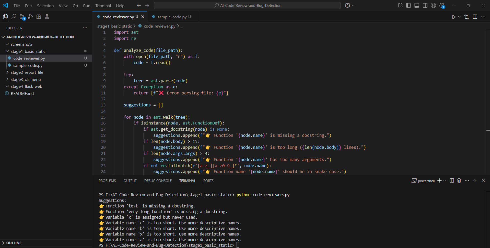
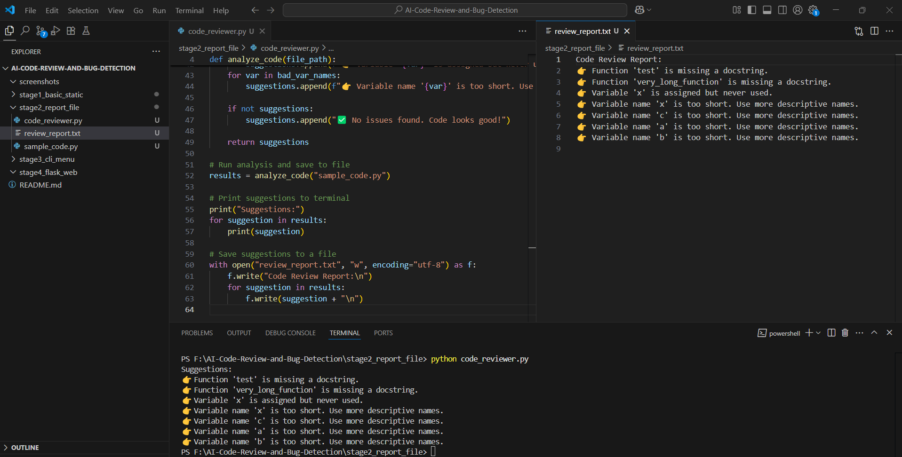
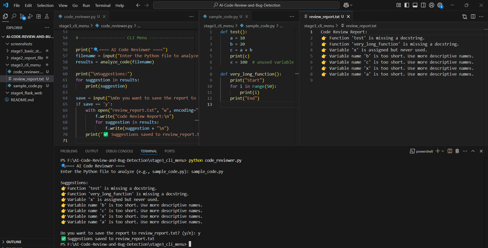
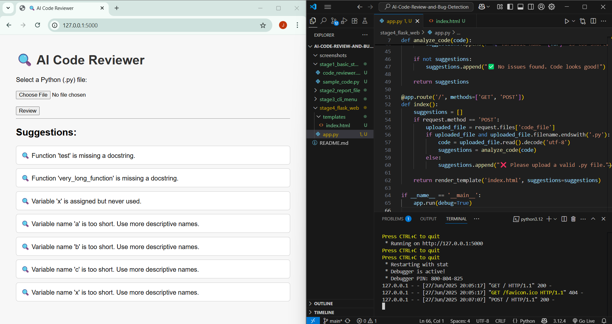

# AI Code Review and Bug Detection 🧠🐛

This project analyzes Python code and gives suggestions like:
- Missing docstrings
- Unused variables
- Poor variable names
- Long functions
- Non-snake_case function names
- Too many function arguments

---

## 🔄 Project Stages

| Stage | Description |
|-------|-------------|
| **Stage 1** | Basic version – Prints code review in terminal |
| **Stage 2** | Also saves suggestions to `review_report.txt` |
| **Stage 3** | Adds CLI menu – user inputs filename and output option |
| **Stage 4** | Flask-based web app to upload `.py` files and view suggestions |

---

## 📂 Folder Structure

```
AI-Code-Review-and-Bug-Detection/
├── stage1_basic_static/
├── stage2_report_file/
├── stage3_cli_menu/
├── stage4_flask_web/
├── screenshots/
└── README.md
```

---

## 🖼️ Screenshots (Click to View)

| Stage | Screenshot |
|-------|------------|
| Stage 1 |  |
| Stage 2 |  |
| Stage 3 |  |
| Stage 4 |  |

---

## 🚀 How to Run Each Stage

### ✅ Stage 1
```bash
cd stage1_basic_static
python code_reviewer.py
```

### ✅ Stage 2
```bash
cd stage2_report_file
python code_reviewer.py
```

### ✅ Stage 3
```bash
cd stage3_cli_menu
python code_reviewer.py
```

### ✅ Stage 4
```bash
cd stage4_flask_web
python app.py
```

Then open your browser at: [http://127.0.0.1:5000/](http://127.0.0.1:5000/)

---

## 💡 Built With

- Python
- AST Module
- Flask (for Stage 4)

---

## 👨‍💻 Author
**Jami Bhargav Venkat**  
[GitHub: bhargavjami](https://github.com/bhargavjami)

